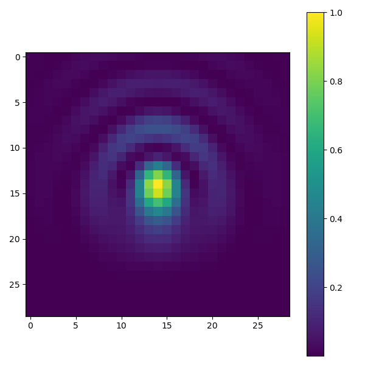

### 'zernpy' - Python package for calculation real-valued Zernike polynomials and associated 2D PSF kernels

#### Project description and references
This project is designed to compute the parameters, real values, and properties of Zernike polynomials using both exact (analytical) and recursive equations. 
Also, 2D (only for imaging plane of the system) PSF kernel can be computed for a single or multiple polynomials.   
The recursive and tabular equations, along with references to the essential information about polynomials, are sourced from the following articles: [[1]](https://doi.org/10.1364/OL.38.002487), 
[[2]](https://doi.org/10.1080/09500340.2011.554896) and [[3]](https://doi.org/10.1364/OE.26.018878).    
The information about PSF can be found on: [4] Principles of Optics, by M. Born and E. Wolf, 4 ed., 1968; [[5]](https://wp.optics.arizona.edu/jsasian/wp-content/uploads/sites/33/2016/03/ZP-Lecture-12.pdf),
[[6]](https://www.researchgate.net/publication/236097143_Imaging_characteristics_of_Zernike_and_annular_polynomial_aberrations), [[7]](https://nijboerzernike.nl/_PDF/JOSA-A-19-849-2002.pdf#[0,{%22name%22:%22Fit%22}]).   
The possibly useful functionality for further usage include: conversion between common indexing schemes (OSA / Noll / Fringe), radial / angular / polynomial 
real values calculation along with their derivatives, plotting the circular 2D or 3D profile of single or sum of polynomials, fitting the arbitrary phase 
profile specified on the circle aperture by the set of polynomials (see the description [below](#fitting-zernike-polynomials-to-a-2D-image-with-phases)).   
For the complete list of implemented methods and properties of Zernike polynomial as the class 'ZernPol', please refer to [ZernPol API documentation](https://sklykov.github.io/zernpy/api/zernpy/zernikepol.html).   
For the implemented 2D PSF kernel calculation associated with Zernike polynomial(-s) as the class 'ZernPSF', please refer to 
[ZernPSF API documentation](https://sklykov.github.io/zernpy/api/zernpy/zernpsf.html).   

**Note:** if you're viewing this README on the PyPI website, images will not be displayed - only their fallback descriptions will be shown. 
For the complete and correctly formatted README, please visit the GitHub repository.

#### Notes about implementation
It was supposed at the project start, that the recursive equations would be the faster way to calculate real values of high order polynomials in comparison 
to usage of their exact definition (that used the sum of factorials, see the [Wiki article](https://en.wikipedia.org/wiki/Zernike_polynomials) for details).        
However, it's turned out during the development and tests, that sum of factorials computation (based on Python built-in *math.factorial* method) even for high 
orders (> 10th order) provides sufficiently fast calculation of radial polynomials.   
On other hand, I found that for polynomials with radial orders higher than 46th order the exact equation with factorials starts providing ambiguous results 
due to the big integer coefficients (exceeding the size of Python built-in *int* type) produced by factorials. Thus, it turns out that the stable way to get 
polynomial (radial) values for these orders is to use the recursive equations for retain stability of calculation along with the drawback of fast 
decreasing of the computational performance with the increased radial order.

### Setup instructions

#### Basic installation
For installation of this package, use the command: ***pip install zernpy***    
For updating already installed package:  ***pip install --upgrade zernpy*** or ***pip install -U zernpy***

#### Requirements
For installation, the *numpy* and *matplotlib* libraries are required.  
For running tests, the *pytest* library is required for automatic recognition of tests stored in the package folders.  

#### Running tests
Simply run the command ***pytest*** in the command line from the project folder root. It should collect 10 tests and automatically run them.

### A few examples of the library features usage

#### Initialization of base class instance
The useful calculation methods are written as the instance and static methods. The first ones are accessible after initialization of a class instance
by providing characteristic orders (see the Zernike polynomial definition, e.g. in [Wiki](https://en.wikipedia.org/wiki/Zernike_polynomials)):   
```python  # code block for Python code
from zernpy import ZernPol
zp = ZernPol(m=-2, n=2)  
```
Alternative initializations using other indices: ***ZernPol(osa_index=3)***, ***ZernPol(noll_index=5)***, ***ZernPol(fringe_index=6)***   
For details, please, refer to the API Dictionary provided on the GitHub page (see "Documentation" tab on [pypi](https://pypi.org/project/zernpy/)).

#### Some useful class instance methods:
1) For getting all characteristic indices for the initialized polynomial: ***zp.get_indices()***   
This method returns the following tuple: *((azimuthal order, radial order), OSA index, Noll index, Fringe index)*
2) For getting the string name of the initialized polynomial (up to 7th order): ***zp.get_polynomial_name()***
3) For calculating polynomial value for polar coordinates (r, theta): ***zp.polynomial_value(r, theta)***  
Note that *r* and *theta* are accepted as float numbers or numpy.ndarrays with the equal shape, it is also applicable for
functions below 4. - 7.    
4) For calculating radial polynomial value for radius (radii) r: ***zp.radial(r)***  
5) For calculating derivative of radial polynomial value for radius (radii) r: ***zp.radial_dr(r)***
6) For calculating triangular function value for angle theta: ***zp.triangular(theta)*** 
7) For calculating derivative of triangular function value for angle theta: ***zp.triangular_dtheta(theta)***   
8) For calculating normalization factor (N): ***zp.normf()*** 

#### Some useful static methods of the ZernPol class:
1) For getting tuple as (azimuthal order, radial order) for OSA index i: ***ZernPol.index2orders(osa_index=i)***  
Same for Fringe and Noll indices: ***ZernPol.index2orders(noll_index=i)*** or ***ZernPol.index2orders(fringe_index=i)***
2) Conversion between indices: ***ZernPol.osa2noll(osa_index)***,
with similar signature: ***noll2osa(...)***, ***osa2fringe(...)***, ***osa2fringe(...)***, ***fringe2osa(...)***
3) Calculation of Zernike polynomials sum: ***ZernPol.sum_zernikes(coefficients, polynomials, r, theta, get_surface)***   
It calculates the sum of initialized Zernike polynomials (*ZernPol*) using coefficients and (r, theta) polar coordinates.
The variable *get_surface* allows returning for vector polar coordinates with different shapes the values as for mesh of these coordinates.
The details of acceptable values - see the docstring of this method or the API Dictionary.
4) Plotting the initialized Zernike polynomial (ZernPol) with default parameters for coordinates: ***ZernPol.plot_profile(polynomial)***   
It plots the Zernike polynomial on unit circle using polar coordinates - on "2D" projection (blocked non-interactive call of *matplotlib.pyplot.show()*).   
For "3D" projection the polar coordinates are converted to the cartesian ones, as demanded by plotting method.  
**(!):** Note that the plotting method name has been changed from  ***plot_profile(...)*** for ver. <= 0.0.10, the new version of the package will be 
simply sequentially incremented, without minor version changing, since there is no packages dependent on this one.   
5) Plotting Zernike polynomials sum:  ***ZernPol.plot_sum_zernikes_on_fig(...)*** - check the list of parameters in the docstring.
By using only default parameters, this method will plot sum of Zernike polynomials specified in the list with their coefficients
on the provided figure (expected as an instance of the class *matplotlib.pyplot.Figure*).

#### Fitting Zernike polynomials to a 2D image with phases
Random generated set of Zernike polynomials plotted on an image - as the sample for testing the fitting procedure:     

        

This image is assumed to contain phases wrapped in a circular aperture, used function for generation:
***generate_random_phases(...)*** from the main *zernikepol* module.    

Below is profile made by calculation of fitted Zernike polynomials:    

               

The function used for fitting: ***fit_polynomials(...)*** from the main *zernikepol* module.    
This function could be useful for making approximation of any image containing phases recorded by the optical system
to the sum of Zernike polynomials. Check the detailed description of functions in the API dictionary, available on
the separate tab on the GitHub page of this repository.   
The function ***fit_polynomials_vectors(...)*** allows to fit composed in vectors (arrays with single dimension) phases 
recorded in polar coordinates (provided separately also in vectors) to the provided set of Zernike polynomials. This is analogous
to the procedure described above, but this function doesn't perform any cropping or phases pre-selection.   
Import statement for using the scripts the mentioned functions:  
```python
from zernpy import generate_polynomials, fit_polynomials, generate_random_phases, generate_phases_image, fit_polynomials_vectors
```
Or for importing all available functions and base class in one statement:    
```python
from zernpy import *
```
Note that the function ***generate_polynomials(...)*** returns tuple with OSA indexed polynomials as instances of the *ZernPol* class, 
starting from the 'Piston' polynomial.    

#### 2D PSF kernel calculation
The 2D PSF kernel is calculated from the diffraction integral over the round pupil plane and described as Zernike polynomial phase distribution 
for the focal point (no Z-axis dependency). The used references are listed in the docstring of the **calculate_psf_kernel()** method.    

The sample of calculated PSF for Vertical Trefoil:    

_Vert._3foil_0.85.png "Vertical Trefoil Kernel")   

Initialization and usage of the class instance (basic usage with default calculation parameters, such as the kernel size):    
```python  # code block for Python code
from zernpy import ZernPSF, ZernPol
zpsf = ZernPSF(ZernPol(m=1, n=3))  # horizontal coma
NA = 0.95; wavelength = 0.55; expansion_coeff = -0.26; pixel_physical_size = 0.2*wavelength   # example of physical properties
zpsf.set_physical_properties(NA, wavelength, expansion_coeff, pixel_physical_size)  # provide physical properties of the system
kernel = zpsf.calculate_psf_kernel(normalized=True)  # get the kernel as the square normalized matrix
```
Check the API documentation for other available methods.     

#### PSF kernel for several polynomials
Similarly to the code above, it's possible to calculate the PSF associated with the sum profile of several polynomials:   
```python
from zernpy import ZernPSF, ZernPol 
zp1 = ZernPol(m=-1, n=3); zp2 = ZernPol(m=2, n=4); zp3 = ZernPol(m=0, n=4); pols = (zp1, zp2, zp3); coeffs = (0.5, 0.21, 0.15)
zpsf_pic = ZernPSF(pols); zpsf_pic.set_physical_props(NA=0.65, wavelength=0.6, expansion_coeff=coeffs, pixel_physical_size=0.6/5.0)
zpsf_pic.calculate_psf_kernel(); zpsf_pic.plot_kernel("Sum of Polynomials Profile")
```
The resulting profile is:    

  

#### Acceleration of kernel calculation by numba
It's possible to accelerate the calculation of a kernel by installing the [numba](https://numba.pydata.org/) library in the 
same Python environment and providing the appropriate flags in a calculation method, similar to the following code snippet:
```python
from zernpy import force_get_psf_compilation, ZernPol, ZernPSF
force_get_psf_compilation()  # optional precompilation of calculation methods for further using of their compiled forms 
NA = 0.95; wavelength = 0.55; pixel_size = wavelength / 4.6; ampl = -0.16
zp = ZernPol(m=0, n=2); zpsf = ZernPSF(zp) 
zpsf.set_physical_props(NA, wavelength, ampl, pixel_size)
zpsf.calculate_psf_kernel(accelerated=True)
```

#### Cropping kernel
By default, the kernel size is overestimated to guarantee that all significant points of kernel will be calculated. Also, kernel size is growing
with the polynomial orders and its amplitude. To reduce the size of kernel, from ver. 0.0.15, it's possible to call the method ***crop_kernel***.
Example of the code: 
```python
from zernpy import ZernPSF, ZernPol
zpsf = ZernPSF(zernpol=(ZernPol(m=0, n=4)))  # Spherical aberration
zpsf.set_physical_props(NA=1.25, wavelength=0.5, expansion_coeff=0.47, pixel_physical_size=0.5/5.0)
zpsf.calculate_psf_kernel(accelerated=True, verbose_info=True); zpsf.plot_kernel("Not Cropped")
zpsf.crop_kernel(min_part_of_max=0.025)  # rows and columns containing less than 2.5% of kernel max will be cropped out 
zpsf.plot_kernel("Cropped")
```
Original kernel with size (23, 23) for Spherical aberration:

_Spherical_0.47_Original.png "Original Spherical aber. kernel (23, 23)")  

Cropped kernel with size (15, 15) for Spherical aberration:

_Spherical_0.47_Cropped.png "Cropped Spherical aber. kernel (15, 15)")  
