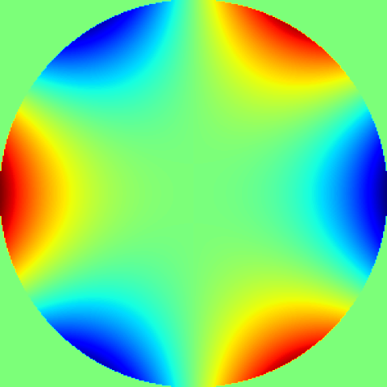
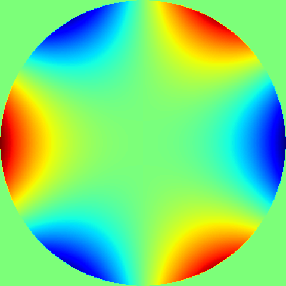

### zernpy - package for calculation Zernike polynomials

This project is intended for calculation of Zernike polynomials parameters / values / properties using exact (analytical) and recursive equations, 
the last ones were supposed to be the faster way to calculate values of high order polynomials in comparison to usage of their exact 
definition (that used the sum of factorials, see the [Wiki article](https://en.wikipedia.org/wiki/Zernike_polynomials) for details).     
However, it's turned out that usage of sum of factorials (calculated from *math.factorial* method) even for high orders provides
sufficiently fast calculation of radial polynomials. On other hand, I found that for polynomials with radial orders higher than 46th order
the exact equation with factorials starts providing ambiguous results due to high integers produced by factorials. Thus, it turns out that
only possible stable way to get polynomial value for high orders is to use the recursive equations for retain stability of calculation along
with the drawback of fast decreasing the performance with increasing of the radial order.    
Also, I hope that someone also would find useful some of developed methods for usage in any further project.     
The recursive and tabular equations are taken from the articles: [[1]](https://doi.org/10.1364/OL.38.002487), 
[[2]](https://doi.org/10.1080/09500340.2011.554896) and [[3]](https://doi.org/10.1364/OE.26.018878).    
Several useful transformations (e.g., from OSA / ANSI index to Noll one) are implemented as the methods of the main class.

### Setup instructions

#### Basic installation
For installation of this package, use the command: ***pip install zernpy***  

#### Running tests for the code from the repository
Using the library *pytest* just run in the root folder for the folder, containing the package: ***pytest***    
It should collect 10 tests and automatically run them.

#### Requirements
For installation the *numpy* and *matplotlib* libraries are required.  
For running tests, the *pytest* library is required for automatic recognition of tests stored in package folders.  

### A few examples of the library features usage
#### Initialization of base class instance
The useful calculation methods are written as the instance and static methods. The first ones are accessible after initialization of a class instance
by providing characteristic orders (see the Zernike polynomial definition, e.g. in [Wiki](https://en.wikipedia.org/wiki/Zernike_polynomials)):   
```python  # code block for Python code
from zernpy import ZernPol
zp = ZernPol(m=-2, n=2)  
```
Alternative initializations using other indices: ***ZernPol(osa_index=3)***, ***ZernPol(noll_index=5)***, ***ZernPol(fringe_index=6)***   
For details, please, refer to the API Dictionary provided on the GitHub page (see "Documentation" tab on [pypi](https://pypi.org/project/zernpy/)).

#### Some useful class instance methods:
1) For getting all characteristic indices for the initialized polynomial: ***zp.get_indices()***   
This method returns the following tuple: *((azimuthal order, radial order), OSA index, Noll index, Fringe index)*
2) For getting the string name of the initialized polynomial (up to 7th order): ***zp.get_polynomial_name()***
3) For calculating polynomial value for polar coordinates (r, theta): ***zp.polynomial_value(r, theta)***  
Note that *r* and *theta* are accepted as float numbers or numpy.ndarrays with the equal shape, it is also applicable for
functions below 4. - 7.    
4) For calculating radial polynomial value for radius (radii) r: ***zp.radial(r)***  
5) For calculating derivative of radial polynomial value for radius (radii) r: ***zp.radial_dr(r)***
6) For calculating triangular function value for angle theta: ***zp.triangular(theta)*** 
7) For calculating derivative of triangular function value for angle theta: ***zp.triangular_dtheta(theta)***   
8) For calculating normalization factor (N): ***zp.normf()*** 

#### Some useful static methods of ZernPol class:
1) For getting tuple as (azimuthal order, radial order) for OSA index i: ***ZernPol.index2orders(osa_index=i)***  
Same for Fringe and Noll indices: ***ZernPol.index2orders(noll_index=i)*** or ***ZernPol.index2orders(fringe_index=i)***
2) Conversion between indices: ***ZernPol.osa2noll(osa_index)***,
with similar signature: ***noll2osa(...)***, ***osa2fringe(...)***, ***osa2fringe(...)***, ***fringe2osa(...)***
3) Calculation of Zernike polynomials sum: ***ZernPol.sum_zernikes(coefficients, polynomials, r, theta, get_surface)***   
It calculates the sum of initialized Zernike polynomials (*ZernPol*) using coefficients and (r, theta) polar coordinates.
The variable *get_surface* allows returning for vector polar coordinates with different shapes the values as for mesh of these coordinates.
The details of acceptable values - see the docstring of this method or the API Dictionary.
4) Plotting the initialized Zernike polynomial (ZernPol) with default parameters for coordinates: ***ZernPol.plot_profile(polynomial)***   
It plots the Zernike polynomial on unit circle using polar coordinates - on "2D" projection (blocked non-interactive call of *matplotlib.pyplot.show()*).   
For "3D" projection the polar coordinates are converted to the cartesian ones, as demanded by plotting method.   
5) Plotting Zernike polynomials sum:  ***ZernPol.plot_sum_zernikes_on_fig(...)*** - check the list of parameters in the docstring.
By using only default parameters, this method will plot sum of Zernike polynomials specified in the list with their coefficients
on the provided figure (expected as an instance of the class *matplotlib.pyplot.Figure*).

#### Fitting Zernike polynomials to a 2D image with phases
Random generated set of Zernike polynomials plotted on an image - as the sample for testing the fitting procedure:     
        
This image is assumed to contain phases wrapped in a circular aperture, used function for generation:
***generate_random_phases(...)*** from the main *zernikepol* module.    
Below is profile made by calculation of fitted Zernike polynomials:    
               
The function used for fitting: ***fit_polynomials(...)*** from the main *zernikepol* module.    
This function could be useful for making approximation of any image containing phases recorded by the optical system
to the sum of Zernike polynomials. Check the detailed description of functions in the API dictionary, available on
the separate tab on the GitHub page of this repository.   
The function ***fit_polynomials_vectors(...)*** allows to fit composed in vectors (arrays with single dimension) phases 
recorded in polar coordinates (provided separately also in vectors) to the provided set of Zernike polynomials. This is analogous
to the procedure described above, but this function doesn't perform any cropping or phases pre-selection.   
Import statement for using the scripts the mentioned functions:  
```python
from zernpy import generate_polynomials, fit_polynomials, generate_random_phases, fit_polynomials_vectors
```
Or for importing all available functions and base class in one statement:    
```python
from zernpy import *
```
Note that the function ***generate_polynomials(...)*** returns tuple with OSA indexed polynomials as instances of *ZernPol* class.   
