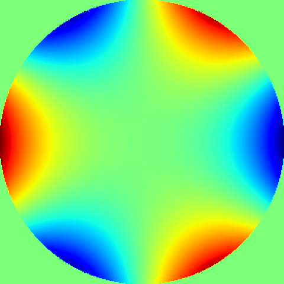
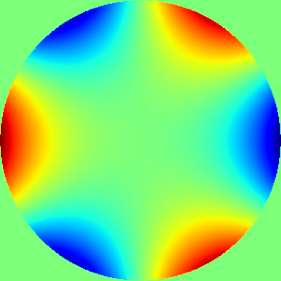

### 'zernpy'
[](https://github.com/sklykov/zernpy/actions/workflows/test.yaml)
[](https://pypi.org/project/zernpy/) 
[](LICENSE)
[](https://github.com/astral-sh/ruff)

Python package for:  
- Calculating real-valued Zernike polynomials based on exact (factorial) and recursive equations;
- Converting between radial (n) + azimuthal (m) orders, OSA, Noll, and Fringe indices; 
- Fitting phase profiles with Zernike polynomials;
- Generating and visualizing wavefronts formed by single or sums of polynomials;
- Computing 2D PSF kernels in imaging plane of an optical system for single and sums of polynomials.

#### Implemented Features

- Real-valued Zernike polynomial computation in analytical and recursive forms;
- Derivatives computation (radial and azimuthal);
- Orders / OSA / Noll / Fringe index conversions;
- Wavefront fitting; 
- 2D PSF kernel simulation (image plane);
- Optional Numba acceleration of computations;
- Visualization (plotting) utilities.

Full API documentation is on: https://sklykov.github.io/zernpy/  
The recursive form of equations used by default, it becomes valuable for high order
polynomials (n > 40) due to numerical stability of computations.

### Setup instructions

#### Basic installation
For installation of this package, use the command: ***pip install zernpy***    
For updating already installed package:  ***pip install --upgrade zernpy*** or ***pip install -U zernpy***

#### Requirements
For installation, the *numpy* and *matplotlib* libraries are required (so far, without version restrictions).  
Tests performed by *pytest* library. Linter and code styling: *ruff*, no-strict typing check: *mypy*.

### Examples
#### Minimal Example
```python
from zernpy import ZernPol
zp = ZernPol(m=0, n=4)  # Spherical polynomial initialization
# Similar init. forms: ZernPol(osa=12), ZernPol(noll=11), ZernPol(fringe=9)
indices = zp.get_indices()  # returns tuple: ((m, n), OSA, Noll, Fringe) orders / indices
naming = zp.get_polynomial_name()  # returns str with polynomial name (up to 7th order)
# Below - radial coordinates acceptable both as Real numbers and as numpy.arrays
value = zp.polynomial_value(r, theta)  # polynomial value(-s) for radial coordinates
value_r = zp.radial(r)  # radial polynomial value(-s)
value_dr = zp.radial_dr(r)  # derivative on r of radial polynomial value(-s)
value_ang = zp.triangular(theta)  # angular polynomial value(-s)
value_ang_dth = zp.triangular_dtheta(theta)  # derivative on theta of angular value(-s)
normalization = zp.normf()  # OSA or Var(ZP)=1 normalization factor
```
#### Example of a few useful static methods
```python
from zernpy import ZernPol
# Notations conversion
m, n = ZernPol.index2orders(osa_index=10)  # Get azimuthal, radial orders. Same for noll_index, fringe_index
noll = ZernPol.osa2noll(10)  # Also available: noll2osa, osa2fringe, osa2fringe, fringe2osa
ZernPol.plot_profile(ZernPol(fringe=11))  # interactive plotting of a single polynomial
# Sum of Zernike polynomials as a surface
zerns = ZernPol(osa=3), ZernPol(osa=6)
zerns_sum_surface = ZernPol.gen_zernikes_surface(coefficients=[0.1, -0.1], polynomials=zerns)
ZernPol.plot_zernikes_surface(zerns_sum_surface)  # interactive matplotlib plot
```

**Note:** if you're viewing this README on the PyPI website, images will not be displayed - only their fallback descriptions will be shown. 
For the complete and correctly formatted README, please visit the GitHub repository.

#### Fitting Zernike polynomials to a 2D phase profile
Random generated set of Zernike polynomials as the sample for testing the fitting procedure:     

        

This image is assumed to contain phases wrapped in a circular aperture, used function for generation:
***generate_random_phases(...)*** from the main *zernikepol* module.    

Below is profile made by calculation of fitted Zernike polynomials:    

               

The function used for fitting: ***fit_polynomials(...)*** from the main *zernikepol* module.    
This function could be useful for making approximation of any image containing phases recorded by the optical system
to the sum of Zernike polynomials. Check the detailed description of functions in the API dictionary, available on
the separate tab on the GitHub page of this repository.   
The function ***fit_polynomials_vectors(...)*** allows to fit composed in vectors (arrays with single dimension) phases 
recorded in polar coordinates (provided separately also in vectors) to the provided set of Zernike polynomials. This is analogous
to the procedure described above, but this function doesn't perform any cropping or phases pre-selection.   
Import statement for using the scripts the mentioned functions:  
```python
from zernpy import (generate_polynomials, fit_polynomials, generate_random_phases, 
                    generate_phases_image, fit_polynomials_vectors)
```
Or alternatively:    
```python
from zernpy import *
```
Note that the function ***generate_polynomials(...)*** returns tuple with OSA indexed polynomials, starting from 'Piston'.    

#### 2D PSF kernel calculation
The 2D PSF kernel is calculated from the diffraction integral over the round pupil plane and described as Zernike polynomial phase 
distribution for the focal point (no Z-axis dependency).  

Initialization and usage of the class instance (basic usage with default calculation parameters, such as the kernel size):    
```python
from zernpy import ZernPSF, ZernPol
zpsf = ZernPSF(ZernPol(m=1, n=3))  # horizontal coma
NA = 0.4; wavelength = 0.55; pixel_physical_size = 0.24*wavelength; expansion_coeff = -0.1
zpsf.set_physical_props(NA, wavelength, expansion_coeff, pixel_physical_size)
kernel = zpsf.calculate_psf_kernel(normalized=True)  # get a kernel as a squared matrix
```
The PSF kernel obtained for horizontal coma with the above parameters is shown below:    
_Hor._coma_-0.1.png "Horizontal Coma Kernel")   
Check the API documentation for other available methods.     

#### PSF kernel for several polynomials
Similarly to the code above, it's possible to calculate the PSF associated with the sum profile of several polynomials:   
```python
from zernpy import ZernPSF, ZernPol 
zp1 = ZernPol(m=-1, n=3); zp2 = ZernPol(m=2, n=4); zp3 = ZernPol(m=0, n=4); pols = (zp1, zp2, zp3); coeffs = (0.5, 0.21, 0.15)
zpsf_pic = ZernPSF(pols); zpsf_pic.set_physical_props(NA=0.65, wavelength=0.6, expansion_coeff=coeffs, pixel_physical_size=0.6/5.0)
zpsf_pic.calculate_psf_kernel(); zpsf_pic.plot_kernel("Sum of Polynomials Profile")
```
The resulting profile is:    

  

#### Acceleration of kernel calculation by numba
It's possible to accelerate the calculation of a kernel by installing the [numba](https://numba.pydata.org/) library in the 
same Python environment and providing the appropriate flags in a calculation method, similar to the following code snippet:
```python
from zernpy import force_get_psf_compilation, ZernPol, ZernPSF
force_get_psf_compilation()  # optional precompilation of calculation methods for further using of their compiled forms 
NA = 0.95; wavelength = 0.55; pixel_size = wavelength / 4.6; ampl = -0.16
zp = ZernPol(m=0, n=2); zpsf = ZernPSF(zp) 
zpsf.set_physical_props(NA, wavelength, ampl, pixel_size)
zpsf.calculate_psf_kernel(accelerated=True)
```

#### Cropping kernel
By default, the kernel size is overestimated to guarantee that all significant points of kernel will be calculated. Also, kernel size is growing
with the polynomial orders and its amplitude. To reduce the size of kernel, from ver. 0.0.15, it's possible to call the method ***crop_kernel***.
Example of the code: 
```python
from zernpy import ZernPSF, ZernPol
zpsf = ZernPSF(zernpol=(ZernPol(m=0, n=4)))  # Spherical aberration
zpsf.set_physical_props(NA=1.25, wavelength=0.5, expansion_coeff=0.47, pixel_physical_size=0.5/5.0)
zpsf.calculate_psf_kernel(accelerated=True, verbose_info=True); zpsf.plot_kernel("Not Cropped")
zpsf.crop_kernel(min_part_of_max=0.025)  # rows and columns containing less than 2.5% of kernel max will be cropped out 
zpsf.plot_kernel("Cropped")
```
Original kernel with size (23, 23) for Spherical aberration:

_Spherical_0.47_Original.png "Original Spherical aber. kernel (23, 23)")  

Cropped kernel with size (15, 15) for Spherical aberration:

_Spherical_0.47_Cropped.png "Cropped Spherical aber. kernel (15, 15)")  

#### References
The recursive and tabular equations, along with references to the essential information about Zernike polynomials, are sourced from:
1. [Honarvar Shakibaei and Paramesran 2013](https://doi.org/10.1364/OL.38.002487)
2. [Lakshminarayanan and Fleck 2011](https://doi.org/10.1080/09500340.2011.554896) 
3. [Andersen 2018](https://doi.org/10.1364/OE.26.018878)

The equations for calculation of PSF are sourced from:
1. Principles of Optics, by M. Born and E. Wolf, 4 ed., 1968
2. Open Source Articles: 
[Lecture](https://wp.optics.arizona.edu/jsasian/wp-content/uploads/sites/33/2016/03/ZP-Lecture-12.pdf), 
[Thesis](https://nijboerzernike.nl/_PDF/JOSA-A-19-849-2002.pdf#[0,{%22name%22:%22Fit%22}]).
3. [Mahajan and Díaz 2013](https://doi.org/10.1364/AO.52.002062)
